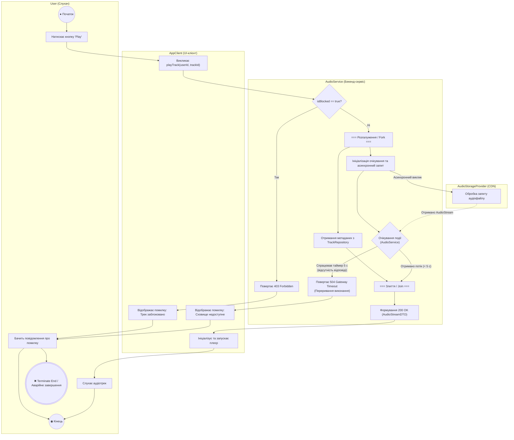

```mermaid
flowchart TD
    subgraph User ["User (Слухач)"]
        Start((● Початок))
        PressPlay["Натискає кнопку 'Play'"]
        ViewError["Бачить повідомлення про помилку"]
        ListenAudio["Слухає аудіотрек"]
        EndNormal((◉ Кінець))
        EndTerminate((( ✖ Terminate End / Аварійне завершення )))
    end

    subgraph AppClient ["AppClient (UI-клієнт)"]
        SendPlayReq["Викликає playTrack(userId, trackId)"]
        ShowError403["Відображає помилку: Трек заблоковано"]
        ShowError504["Відображає помилку: Сховище недоступне"]
        RenderPlayer["Ініціалізує та запускає плеєр"]
    end

    subgraph AudioService ["AudioService (Бекенд-сервіс)"]
        CheckBlock{"isBlocked == true?"}
        Return403["Повертає 403 Forbidden"]

        Fork[=== Розгалуження / Fork ===]

        FetchMetadata["Отримання метаданих з TrackRepository"]
        
        ReqStream["Ініціалізація очікування та асинхронний запит"]
        WaitEvent{"Очікування події\n(AudioService)"}
        
        Return504["Повертає 504 Gateway Timeout\n(Переривання виконання)"]

        Join[=== Злиття / Join ===]
        
        PrepareResponse["Формування 200 OK (AudioStreamDTO)"]
    end

    subgraph AudioStorageProvider ["AudioStorageProvider (CDN)"]
        ProcessStreamReq["Обробка запиту аудіофайлу"]
    end

    %% Основний потік запуску
    Start --> PressPlay
    PressPlay --> SendPlayReq
    SendPlayReq --> CheckBlock

    %% Гілка блокування контенту (SC-05)
    CheckBlock -- Так --> Return403
    Return403 --> ShowError403
    ShowError403 --> ViewError
    ViewError --> EndNormal

    %% Паралельний потік (Fork)
    CheckBlock -- Ні --> Fork
    Fork --> FetchMetadata
    Fork --> ReqStream

    %% Паралельна гілка 1: Метадані
    FetchMetadata --> Join

    %% Паралельна гілка 2: Асинхронний запит до CDN та локальне очікування
    ReqStream -->|Асинхронний виклик| ProcessStreamReq
    ReqStream --> WaitEvent

    %% Отримання потоку від CDN (якщо CDN встигає відповісти)
    ProcessStreamReq -.->|Отримано AudioStream| WaitEvent

    %% Розгалуження подій очікування
    WaitEvent -- "Отримано потік (< 5 с)" --> Join
    WaitEvent -- "Спрацював таймер 5 с\n(відсутність відповіді)" --> Return504

    %% Гілка таймауту (SC-02) з повним перериванням процесу (Terminate End)
    Return504 --> ShowError504
    ShowError504 --> ViewError
    ViewError --> EndTerminate

    %% Успішне завершення (SC-01)
    Join --> PrepareResponse
    PrepareResponse --> RenderPlayer
    RenderPlayer --> ListenAudio
    ListenAudio --> EndNormal
```