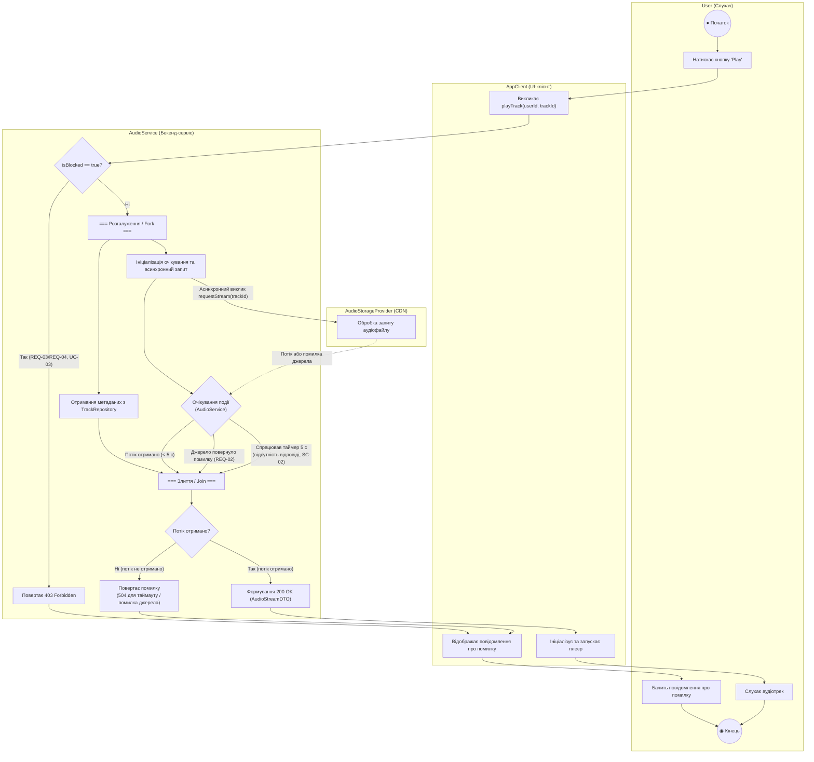

```mermaid
flowchart TD
    subgraph User ["User (Слухач)"]
        Start(("● Початок"))
        PressPlay["Натискає кнопку 'Play'"]
        ViewError["Бачить повідомлення про помилку"]
        ListenAudio["Слухає аудіотрек"]
        EndNormal(("◉ Кінець"))
    end

    subgraph AppClient ["AppClient (UI-клієнт)"]
        SendPlayReq["Викликає playTrack(userId, trackId)"]
        ShowError["Відображає повідомлення про помилку"]
        RenderPlayer["Ініціалізує та запускає плеєр"]
    end

    subgraph AudioService ["AudioService (Бекенд-сервіс)"]
        CheckBlock{"isBlocked == true?"}
        Return403["Повертає 403 Forbidden"]

        Fork["=== Розгалуження / Fork ==="]

        FetchMetadata["Отримання метаданих з TrackRepository"]

        ReqStream["Ініціалізація очікування та асинхронний запит"]
        WaitEvent{"Очікування події\n(AudioService)"}

        Join["=== Злиття / Join ==="]

        CheckStream{"Потік отримано?"}
        PrepareResponse["Формування 200 OK (AudioStreamDTO)"]
        ReturnStreamError["Повертає помилку\n(504 для таймауту / помилка джерела)"]
    end

    subgraph AudioStorageProvider ["AudioStorageProvider (CDN)"]
        ProcessStreamReq["Обробка запиту аудіофайлу"]
    end

    %% Основний потік запуску
    Start --> PressPlay
    PressPlay --> SendPlayReq
    SendPlayReq --> CheckBlock

    %% Гілка блокування контенту (REQ-03/REQ-04, UC-03)
    CheckBlock -- "Так (REQ-03/REQ-04, UC-03)" --> Return403
    Return403 --> ShowError

    %% Паралельний потік (Fork)
    CheckBlock -- "Ні" --> Fork
    Fork --> FetchMetadata
    Fork --> ReqStream

    %% Паралельна гілка 1: Метадані
    FetchMetadata --> Join

    %% Паралельна гілка 2: Асинхронний запит до CDN та локальне очікування
    ReqStream -->|"Асинхронний виклик requestStream(trackId)"| ProcessStreamReq
    ReqStream --> WaitEvent

    %% Відповідь від CDN (потік або помилка джерела)
    ProcessStreamReq -.->|"Потік або помилка джерела"| WaitEvent

    %% Три події очікування (усі ведуть до Join без дострокового виходу)
    WaitEvent -- "Потік отримано (< 5 с)" --> Join
    WaitEvent -- "Джерело повернуло помилку (REQ-02)" --> Join
    WaitEvent -- "Спрацював таймер 5 с\n(відсутність відповіді, SC-02)" --> Join

    %% Розгалуження після Join за результатом
    Join --> CheckStream
    CheckStream -- "Так (потік отримано)" --> PrepareResponse
    CheckStream -- "Ні (потік не отримано)" --> ReturnStreamError

    %% Єдиний вузол показу помилки (403, помилка джерела, 504)
    ReturnStreamError --> ShowError
    ShowError --> ViewError
    ViewError --> EndNormal

    %% Успішне завершення (SC-01)
    PrepareResponse --> RenderPlayer
    RenderPlayer --> ListenAudio
    ListenAudio --> EndNormal
```