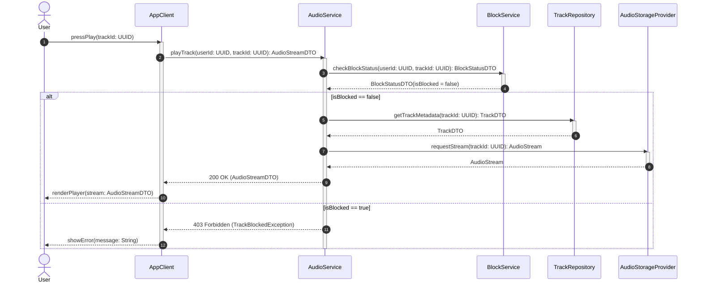

```mermaid
sequenceDiagram
    autonumber
    actor User
    participant AppClient
    participant AudioService
    participant BlockService
    participant TrackRepository
    participant AudioStorageProvider

    User->>AppClient: pressPlay(trackId: UUID)
    activate AppClient
    AppClient->>AudioService: playTrack(userId: UUID, trackId: UUID): AudioStreamDTO
    activate AudioService

    AudioService->>BlockService: checkBlockStatus(userId: UUID, trackId: UUID): BlockStatusDTO
    activate BlockService
    BlockService-->>AudioService: BlockStatusDTO(isBlocked = false)
    deactivate BlockService

    alt isBlocked == false
        AudioService->>TrackRepository: getTrackMetadata(trackId: UUID): TrackDTO
        activate TrackRepository
        TrackRepository-->>AudioService: TrackDTO
        deactivate TrackRepository

        AudioService->>AudioStorageProvider: requestStream(trackId: UUID): AudioStream
        activate AudioStorageProvider
        AudioStorageProvider-->>AudioService: AudioStream
        deactivate AudioStorageProvider

        AudioService-->>AppClient: 200 OK (AudioStreamDTO)
        AppClient-->>User: renderPlayer(stream: AudioStreamDTO)
    else isBlocked == true
        AudioService-->>AppClient: 403 Forbidden (TrackBlockedException)
        AppClient-->>User: showError(message: String)
    end

    deactivate AudioService
    deactivate AppClient
```