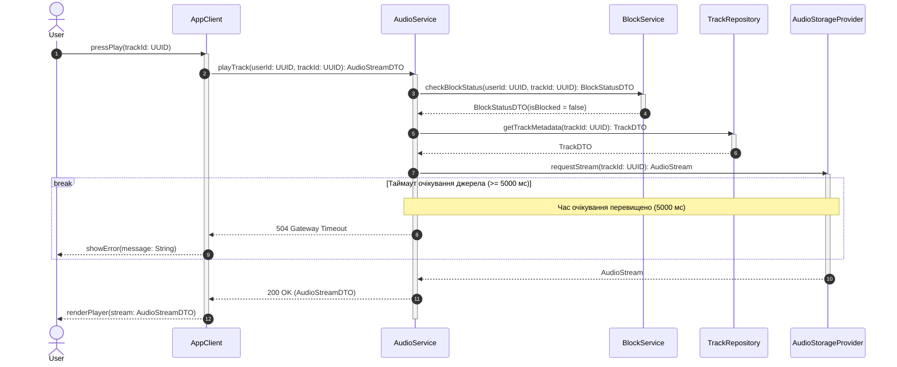

```mermaid
sequenceDiagram
    autonumber
    actor User
    participant AppClient
    participant AudioService
    participant BlockService
    participant TrackRepository
    participant AudioStorageProvider

    User->>AppClient: pressPlay(trackId: UUID)
    activate AppClient
    AppClient->>AudioService: playTrack(userId: UUID, trackId: UUID): AudioStreamDTO
    activate AudioService

    AudioService->>BlockService: checkBlockStatus(userId: UUID, trackId: UUID): BlockStatusDTO
    activate BlockService
    BlockService-->>AudioService: BlockStatusDTO(isBlocked = false)
    deactivate BlockService

    AudioService->>TrackRepository: getTrackMetadata(trackId: UUID): TrackDTO
    activate TrackRepository
    TrackRepository-->>AudioService: TrackDTO
    deactivate TrackRepository

    AudioService->>AudioStorageProvider: requestStream(trackId: UUID): AudioStream
    activate AudioStorageProvider

    break Таймаут очікування джерела (>= 5000 мс)
        Note over AudioStorageProvider,AudioService: Час очікування перевищено (5000 мс)
        AudioService-->>AppClient: 504 Gateway Timeout
        AppClient-->>User: showError(message: String)
    end

    AudioStorageProvider-->>AudioService: AudioStream
    deactivate AudioStorageProvider
    AudioService-->>AppClient: 200 OK (AudioStreamDTO)
    AppClient-->>User: renderPlayer(stream: AudioStreamDTO)

    deactivate AudioService
    deactivate AppClient
```