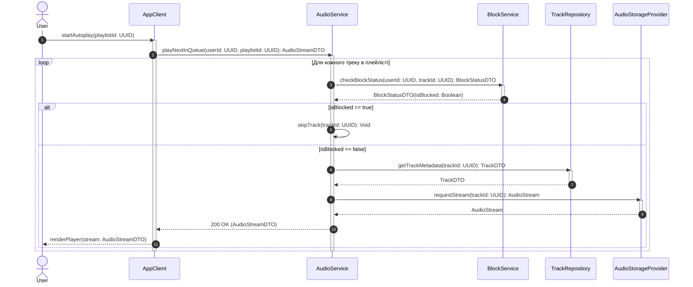

```mermaid
sequenceDiagram
    autonumber
    actor User
    participant AppClient
    participant AudioService
    participant BlockService
    participant TrackRepository
    participant AudioStorageProvider

    User->>AppClient: startAutoplay(playlistId: UUID)
    activate AppClient
    AppClient->>AudioService: playNextInQueue(userId: UUID, playlistId: UUID): AudioStreamDTO
    activate AudioService

    loop Для кожного треку в плейлісті
        AudioService->>BlockService: checkBlockStatus(userId: UUID, trackId: UUID): BlockStatusDTO
        activate BlockService
        BlockService-->>AudioService: BlockStatusDTO(isBlocked: Boolean)
        deactivate BlockService

        alt isBlocked == true
            AudioService->>AudioService: skipTrack(trackId: UUID): Void
        else isBlocked == false
            AudioService->>TrackRepository: getTrackMetadata(trackId: UUID): TrackDTO
            activate TrackRepository
            TrackRepository-->>AudioService: TrackDTO
            deactivate TrackRepository

            AudioService->>AudioStorageProvider: requestStream(trackId: UUID): AudioStream
            activate AudioStorageProvider
            AudioStorageProvider-->>AudioService: AudioStream
            deactivate AudioStorageProvider

            AudioService-->>AppClient: 200 OK (AudioStreamDTO)
            AppClient-->>User: renderPlayer(stream: AudioStreamDTO)
        end
    end

    deactivate AudioService
    deactivate AppClient
```